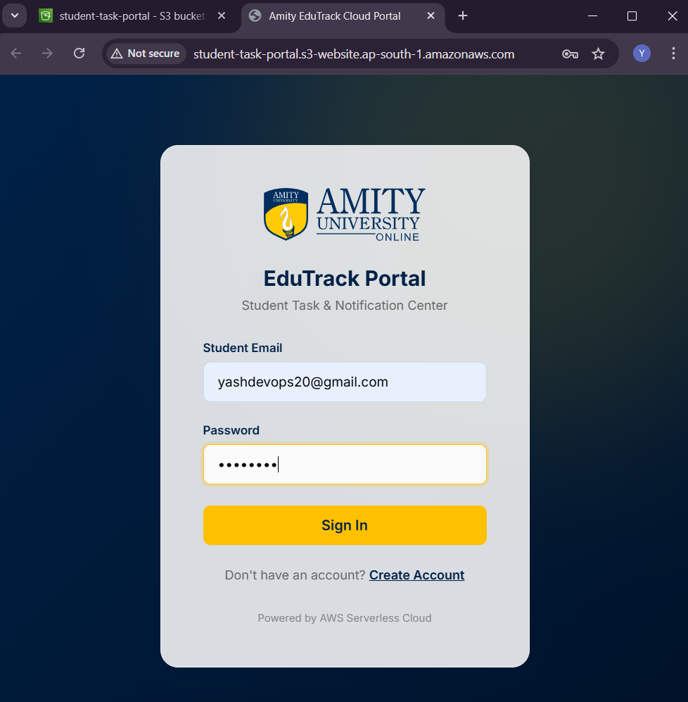
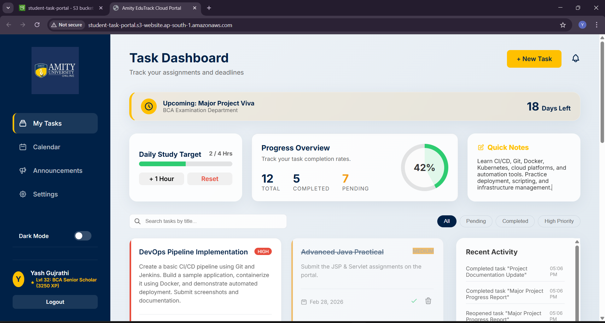

# 🎓 Student Task & Notification Management Portal
### TCS iON Industry Project — AIP-225


> A cloud-native serverless web application for managing academic tasks, deadline notifications, and faculty announcements — built entirely on Amazon Web Services.


---

## 📸 Screenshots

### 🔐 Login Page

*Amity EduTrack Portal — Secure login powered by AWS Cognito*

---

### 📊 Task Dashboard

*Task Dashboard — showing task progress, gamification (Level 32: BCA Senior Scholar), daily study target, and task cards*

---

### 🚀 CI/CD Pipeline — All Stages Succeeded

*AWS CodePipeline — StudentPortalPipeline: Source ✅ → Build ✅ → Deploy ✅ — All actions succeeded*

---

## 📌 Table of Contents
- [About the Project](#about-the-project)
- [Features](#features)
- [Architecture](#architecture)
- [Tech Stack](#tech-stack)
- [AWS Services Used](#aws-services-used)
- [Project Structure](#project-structure)
- [Getting Started](#getting-started)
- [API Endpoints](#api-endpoints)
- [CI/CD Pipeline](#cicd-pipeline)
- [Author](#author)

---

## 📖 About the Project

This project is built as part of the **TCS iON Industry Project Programme (AIP-225)**. It solves the real-world problem of fragmented academic communication in Indian universities by providing a single, centralised, cloud-hosted platform where students can:

- Track all academic tasks and deadlines in one place
- Receive automated email reminders before deadlines
- View faculty announcements in real time
- Access everything from any device — mobile or desktop

---

## ✨ Features

| Feature | Description |
|---------|-------------|
| ✅ Task Management | Create, update, delete, and track academic tasks |
| 🔐 Authentication | Secure login and registration via AWS Cognito |
| 📧 Auto Notifications | Daily deadline reminders via Amazon SNS |
| 📅 Calendar View | Visualise deadlines by date |
| 🌙 Dark Mode | Toggle between light and dark themes |
| 🏆 Gamification | XP points and level badges for task completion |
| 📢 Announcements | Faculty announcements section |
| 📁 File Upload | Attach files to tasks via Amazon S3 |
| 🚀 CI/CD | Auto-deploy on every GitHub commit |
| 📊 Monitoring | CloudWatch dashboard for all services |

---

## 🏗️ Architecture
```
┌─────────────┐     ┌──────────────┐     ┌─────────────────┐
│   Student   │────▶│   Amazon S3  │     │   AWS Cognito   │
│  (Browser)  │     │  (Frontend)  │     │  (Auth / JWT)   │
└─────────────┘     └──────────────┘     └─────────────────┘
       │                                          │
       │ HTTPS + JWT Token                        │
       ▼                                          ▼
┌─────────────────────────────────────────────────────────┐
│                   AWS API Gateway                        │
│              (REST API — StudentPortalAPI)               │
└─────────────────────────────────────────────────────────┘
                          │
                          ▼
              ┌───────────────────────┐
              │      AWS Lambda        │
              │   (tasksHandler.js)    │
              │     Node.js 24.x       │
              └───────────────────────┘
                 │               │
        ┌────────┘               └────────┐
        ▼                                 ▼
┌──────────────────┐           ┌──────────────────┐
│  Amazon DynamoDB │           │   Amazon SNS     │
│ AmityEduTrack_   │           │ DeadlineReminders│
│     Tasks        │           │  (Email Alerts)  │
└──────────────────┘           └──────────────────┘
                                        ▲
                               ┌────────┘
                    ┌─────────────────────┐
                    │  AWS EventBridge     │
                    │ (Daily Scheduler)    │
                    └─────────────────────┘

─────────────── CI/CD ───────────────
GitHub ──▶ CodePipeline ──▶ CodeBuild ──▶ S3 + Lambda
─────────────── Monitoring ──────────
All Services ──▶ AWS CloudWatch Dashboard
```

---

## 🛠️ Tech Stack

**Frontend:**
- HTML5, CSS3, JavaScript (ES6+)
- Single Page Application (SPA) — no framework
- Hosted on Amazon S3 (Static Website Hosting)

**Backend:**
- AWS Lambda — Node.js 24.x
- AWS SDK v3 (modular imports)
- RESTful API via AWS API Gateway

**Database:**
- Amazon DynamoDB (NoSQL, On-demand capacity)

---

## ☁️ AWS Services Used

| Service | Purpose |
|---------|---------|
| Amazon S3 | Frontend static website hosting |
| AWS Lambda | Serverless backend (Node.js 24.x) |
| Amazon DynamoDB | NoSQL database for tasks and announcements |
| AWS API Gateway | REST API endpoints |
| AWS Cognito | User authentication and JWT tokens |
| Amazon SNS | Email deadline notifications |
| AWS EventBridge | Daily reminder scheduling (cron) |
| AWS CodePipeline | CI/CD orchestration |
| AWS CodeBuild | Automated build and deployment |
| AWS CloudWatch | Monitoring, logs, and dashboards |
| AWS IAM | Access control and permissions |

---

## 📁 Project Structure
```
TCS-ION-AIP-225-INTERNSHIP-PROJECT/
│
├── index.html                  # Main SPA frontend
├── css/
│   ├── styles.css              # Core styles
│   └── features.css            # Feature-specific styles
├── js/
│   └── app.js                  # Frontend application logic
├── backend/
│   └── tasksHandler.js         # Lambda function (CRUD operations)
├── screenshots/
│   ├── login.png               # Login page screenshot
│   ├── dashboard.png           # Dashboard screenshot
│   └── pipeline.png            # CodePipeline screenshot
└── README.md                   # This file
```

---

## 🚀 Getting Started

### 1. Clone the Repository
```bash
git clone https://github.com/YashDevops20/TCS-ION-AIP-225-INTERNSHIP-PROJECT.git
cd TCS-ION-AIP-225-INTERNSHIP-PROJECT
```

### 2. Deploy Frontend to S3
```bash
aws s3 mb s3://your-bucket-name --region ap-south-1
aws s3 sync . s3://your-bucket-name --exclude "backend/*" --exclude ".git/*"
```

### 3. Deploy Lambda Function
```bash
cd backend
zip -r function.zip .
aws lambda update-function-code --function-name tasksHandler --zip-file fileb://function.zip
```

### 4. Set Environment Variables on Lambda
```
TASKS_TABLE = AmityEduTrack_Tasks
SNS_TOPIC_ARN = arn:aws:sns:ap-south-1:YOUR_ACCOUNT:DeadlineReminders
```

---

## 📡 API Endpoints

| Method | Endpoint | Description | Auth |
|--------|----------|-------------|------|
| GET | `/tasks` | Get all tasks | ✅ JWT |
| POST | `/tasks` | Create new task | ✅ JWT |
| PUT | `/tasks/{id}` | Update task | ✅ JWT |
| DELETE | `/tasks/{id}` | Delete task | ✅ JWT |
| GET | `/announcements` | Get announcements | ✅ JWT |

---

## 🔄 CI/CD Pipeline

Every push to `main` branch automatically:
1. Triggers AWS CodePipeline
2. CodeBuild syncs frontend files to S3
3. CodeBuild packages and updates Lambda function
4. Live application updated within 2–3 minutes

---

## 🔐 Security

- All API endpoints protected by **Cognito JWT token validation**
- IAM **least-privilege roles** for all Lambda functions
- S3 bucket allows **public read only** for static assets
- All data in transit encrypted via **HTTPS/TLS**
- DynamoDB data encrypted **at rest** using AWS-managed keys

---

